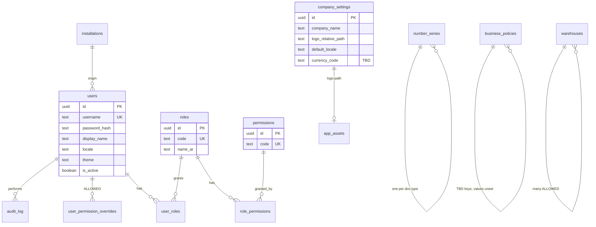
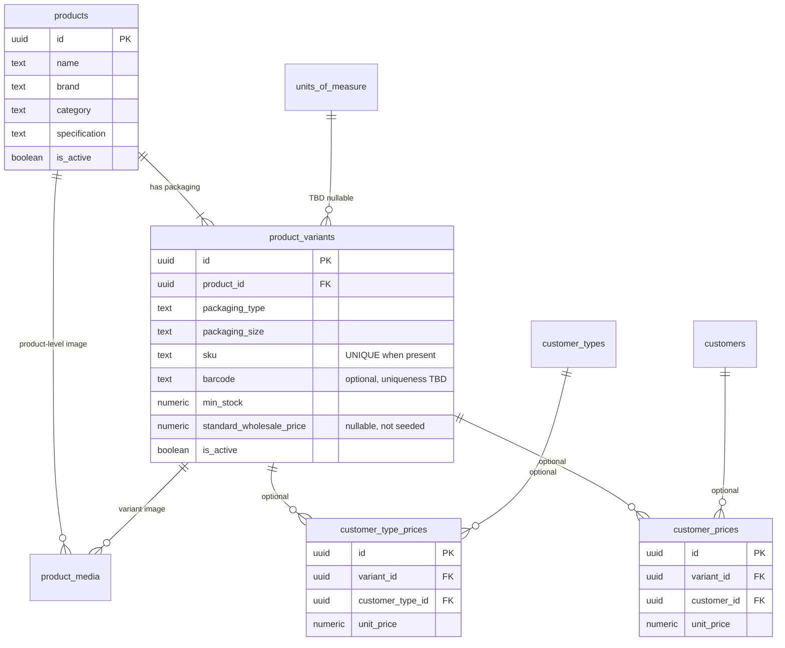
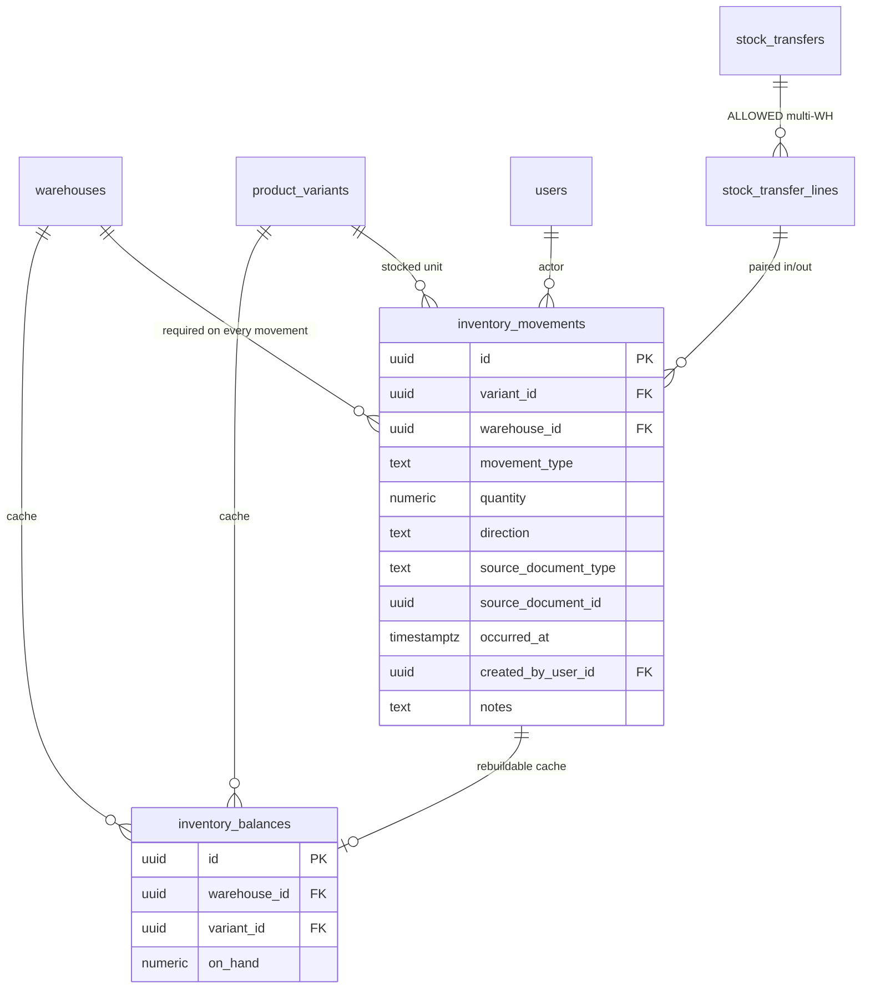
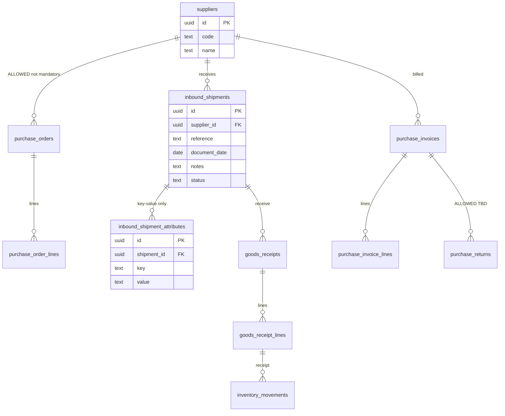
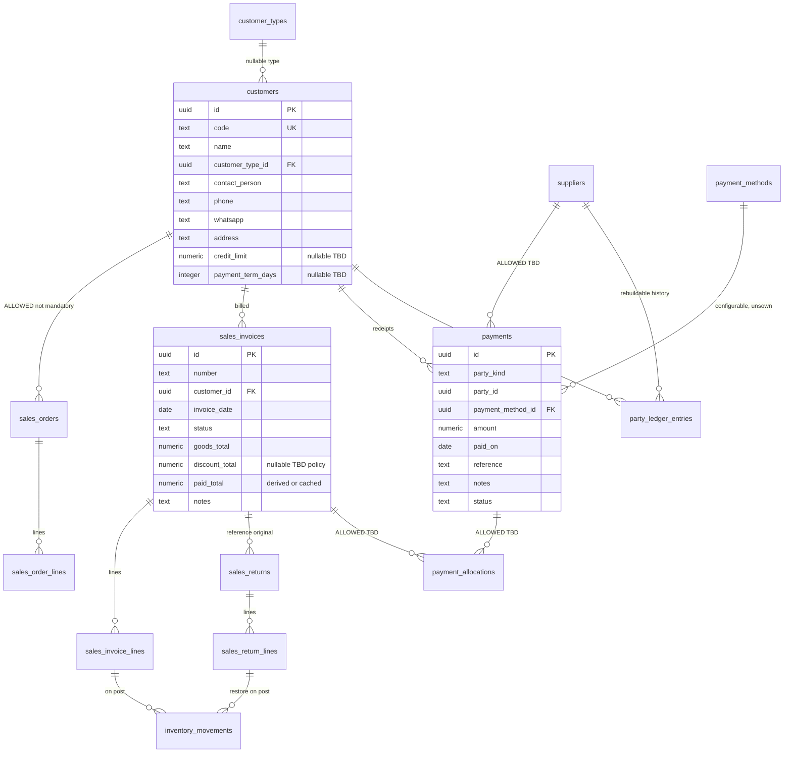
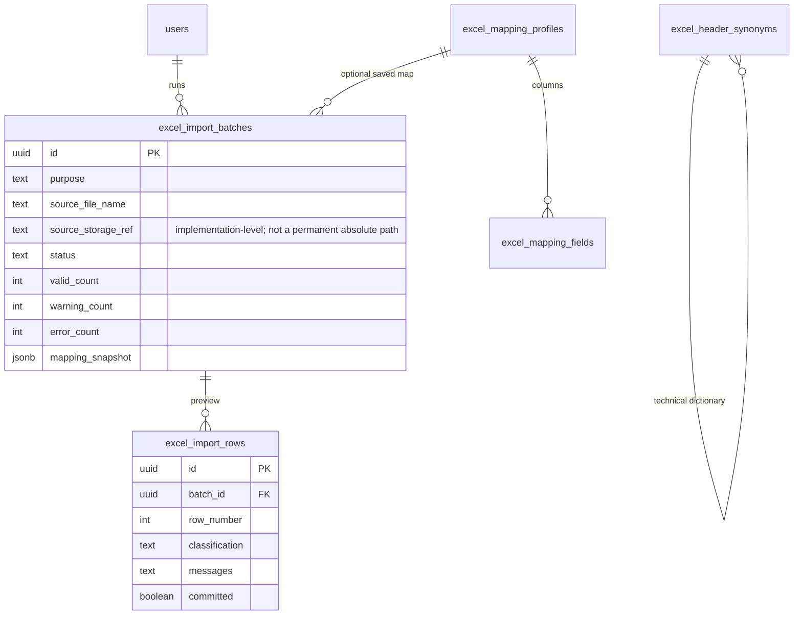

# Petro Trans — Phase 3 Database Schema & Data Model

**Status:** Approved with Phase 3 clarifications (16 August 2026)  
**Date:** 16 August 2026  
**Scope:** Data model documentation only. No migrations, no scaffolding, no UI, no module code. Phase 4 not started.

This schema preserves Phase 1 locked requirements, Phase 2 architecture, and the Phase 3 owner clarifications below. Anything still **TBD** stays TBD. The model *allows* later decisions; it does not fill them in.

No prices, customers, suppliers, payment methods, tax rules, ADNOC fields, warehouses, UOM, costing, return accounting, invoice numbering, or accounting behaviour are invented or seeded.

---

## 0. How to read this document

| Marker | Meaning |
|---|---|
| **LOCKED** | Required by Phase 1 / approved Phase 2. In the schema. |
| **ALLOWED** | Table/column exists so a TBD can be configured later without a redesign. Unused until decided. |
| **TBD** | Business rule not decided. No default policy is implied by the column existing. |
| **OUT** | Intentionally omitted so we do not invent a rule (tax engine, GL, costing layers, public-website catalog). |

Physical implementation (Phase 7) will use **SQLite** via EF Core, with portable types toward PostgreSQL.

---

## 0.1 Phase 3 owner clarifications (CONFIRMED)

| Item | Decision |
|---|---|
| Assets | Official source is project `assets/`. Do not invent or guess the logo filename. **Exact logo path remains TBD** until the folder is inspected. |
| `owner_manager` | **Seed this role** for the business owner (father). |
| `pricing.override` | Granted **only** to `owner_manager` for now. **Admin does not automatically receive it.** |
| Customer types | Configurable/editable. Not a closed list. **Do not seed** unless later explicitly approved. |
| SKU | If a SKU exists, it **must be unique per product variant**. SKU remains optional. |
| Payment methods | `payment_methods` stays **empty/unsown**. Configured later from Settings. |
| Barcode | Optional. **No uniqueness** until barcode policy is confirmed. |
| Sales / purchase orders | Tables **ALLOWED / TBD**. **Not mandatory** in current sales or purchasing workflows. |
| Excel original file | Do **not** treat the original absolute path as the permanent source. Store batch metadata and audit safely. File-copy storage is implementation-level. |

All other Phase 1 TBDs remain TBD (tax, currency, warehouses, UOM, costing, return accounting, invoice numbering, ADNOC fields, etc.).

---

## 1. Global conventions

### 1.1 Identity

| Rule | Choice | Notes |
|---|---|---|
| Primary key | `id` UUID v7 | Sync-friendly, time-orderable. Not a business document number. |
| Business codes | Separate unique columns | Example: `customers.code` = `CUS-0001` (**LOCKED** format). |
| Invoice / PO / payment numbers | `number_series` + document `number` | **Format of invoices is TBD.** Series table is configurable. Do not seed `INV-0001`. |

### 1.2 Audit fields (on every business table unless noted)

| Column | Type | Required |
|---|---|---|
| `id` | UUID | yes |
| `created_at` | timestamptz UTC | yes |
| `created_by_user_id` | UUID, FK users, nullable | system rows may be null |
| `updated_at` | timestamptz UTC | yes |
| `updated_by_user_id` | UUID, nullable | |
| `row_version` | integer, increment on update | future sync / optimistic concurrency |

**Soft delete** (`deleted_at`, `deleted_by_user_id`) applies to **masters only**: users, products, variants, customers, suppliers, warehouses, lookup rows.

**Do not soft-delete** inventory movements or posted document lines. Corrections are reversing documents (policy in Phase 4, **TBD**).

### 1.3 Sync-ready columns (unused in v1)

On every table that may sync later:

- `origin_installation_id` UUID nullable  
- `idempotency_key` TEXT nullable, unique per document type when present  

No sync state machine is implemented now.

### 1.4 Amounts and quantities

| Kind | Storage | Policy |
|---|---|---|
| Money | `numeric(18,4)` | Storage precision only. **Currency is TBD** (EGP proposed, not locked). No FX tables. |
| Quantity | `numeric(18,4)` | **UOM is TBD.** Precision does not mean the business sells fractions of a carton. Application scale is Phase 4. |

No generated “current balance” or “on-hand” column is the source of truth.

### 1.5 Document lifecycle (technical, not accounting policy)

`document_status`: `draft` | `posted` | `voided`

- Draft: editable, **does not** write inventory or party history.  
- Posted: writes ledger effects defined in Phase 4.  
- Voided: **TBD** whether allowed; column exists so status is not overloaded.

Silent edit of posted invoices remains **TBD** (Phase 1 B1 / Phase 2 Q6). The schema can store status; it does not enforce immutability by itself.

### 1.6 Language and branding (not translatable product catalogs)

- Business text (product names, customer names) is stored as entered, Unicode. Arabic is expected. Optional `name_en` columns are **not** added until requested.  
- UI language is a **user preference**, not a row-per-language in masters.  
- Logo and product images are **file path references** into the official local `assets/` folder. Images are not stored as blobs. External images are not downloaded.

**Assets (CONFIRMED):** the project `assets/` folder is the official source for the Petro Trans logo and product images. Do not invent, guess, replace, or download files. **Exact logo path/filename remains TBD** until the actual folder is inspected. `company_settings.logo_relative_path` stays null until then.

### 1.7 Public website

**OUT.** No `cms_*`, no `public_catalog_publish` flag required for v1. The ERP must not be coupled to a future site. If a publish flag is needed later, it is a new migration.

---

## 2. ERD

### 2.1 Identity, security, settings



### 2.2 Catalog, assets, pricing



### 2.3 Inventory ledger



### 2.4 Purchasing



### 2.5 Customers, sales, returns, payments



### 2.6 Excel import / export



---

## 3. Entity list

Grouped by module. **Seed** means technical rows required for the app to boot (roles, permission codes). Never business masters.

### 3.1 Platform

| Entity | Purpose | Seed |
|---|---|---|
| `installations` | This PC / future sync origin | one local row on first run |
| `users` | App login | none (first-run wizard creates Admin) |
| `roles` | RBAC bundles | `admin`, `sales`, `warehouse`, `accountant`, **`owner_manager` (CONFIRMED seed)** |
| `permissions` | Fine-grained codes | technical permission catalog |
| `role_permissions` | Role → permission | **starting matrix in Phase 5, not locked here** |
| `user_roles` | User → role | none |
| `user_permission_overrides` | ALLOWED extra allow/deny | unused until Phase 5 |
| `audit_log` | Sensitive-action trail | none |
| `user_preferences` | UI language, theme | per user |

### 3.2 Settings & lookups

| Entity | Purpose | Seed |
|---|---|---|
| `company_settings` | Singleton: name, logo path, default locale `ar`, **currency_code TBD** | one row; **`logo_relative_path` TBD until `assets/` is inspected — do not guess the filename** |
| `app_assets` | Registry of local files under `assets/` | none until files are listed; do not invent |
| `number_series` | Configurable document numbering | **customer** series `CUS` + 4 digits **LOCKED**; invoice/payment/PO formats **TBD** empty |
| `warehouses` | Warehouse on every movement | none named; first warehouse is setup data, not invented “Main” in this spec |
| `customer_types` | Configurable/editable lookup. **Not a closed list.** | **none. Not seeded unless later explicitly approved** |
| `payment_methods` | Lookup | **none. LOCKED: empty/unsown; configured later from Settings** |
| `units_of_measure` | ALLOWED | **none. UOM TBD** |
| `business_policies` | TBD flags stored as unset | keys listed, `value` null, `is_configured` false |

### 3.3 Catalog

| Entity | Purpose |
|---|---|
| `products` | Parent commercial item |
| `product_variants` | Sellable / stockable packaging |
| `product_media` | Relative paths to provided images under `assets/` |

The Phase 1 product list is **import data**, not schema seed.

### 3.4 Pricing

| Entity | Purpose |
|---|---|
| `product_variants.standard_wholesale_price` | Optional standard price (nullable, not seeded) |
| `customer_type_prices` | Optional per type |
| `customer_prices` | Optional per customer |
| `sales_invoice_lines` price snapshot | Price actually used + source + override audit columns |

### 3.5 Inventory

| Entity | Purpose |
|---|---|
| `inventory_movements` | **Source of truth** |
| `inventory_balances` | Rebuildable cache `(warehouse, variant)` |
| `stock_transfers` + `stock_transfer_lines` | ALLOWED paired transfer document |

### 3.6 Purchasing

| Entity | Purpose |
|---|---|
| `suppliers` | Masters; **none seeded** |
| `purchase_orders` + lines | ALLOWED / TBD. **Not mandatory** in the current purchasing workflow |
| `inbound_shipments` | Generic inbound header |
| `inbound_shipment_attributes` | Key/value only — **no ADNOC columns** |
| `goods_receipts` + lines | Stock-in document → movements |
| `purchase_invoices` + lines | Supplier payable source |
| `purchase_returns` + lines | ALLOWED; use **TBD** |

Purchase unit cost on receipt/invoice **lines** is stored when the user enters it. That is document data, not a costing method (FIFO / average = **TBD / OUT** of v1 profit).

### 3.7 Sales & AR/AP history

| Entity | Purpose |
|---|---|
| `customers` | B2B masters; **none seeded** |
| `sales_orders` + lines | ALLOWED / TBD. **Not mandatory** in the current sales workflow |
| `sales_invoices` + lines | Wholesale invoice |
| `sales_returns` + lines | Inventory restore; **financial posting TBD** |
| `payments` | Customer receipts; supplier payments ALLOWED |
| `payment_allocations` | ALLOWED invoice matching; **policy TBD** |
| `party_ledger_entries` | Rebuildable timeline; not a GL |

### 3.8 Excel

| Entity | Purpose |
|---|---|
| `excel_header_synonyms` | Technical Arabic/English header dictionary |
| `excel_mapping_profiles` + `excel_mapping_fields` | Saved column maps |
| `excel_import_batches` | One upload/analyze/commit |
| `excel_import_rows` | Per-row VALID / WARNING / ERROR |
| `excel_export_jobs` | Optional audit of generated reports |

---

## 4. Relationships (cardinality)

| From | To | Cardinality | Rule |
|---|---|---|---|
| product | product_variant | 1:N | Variant cannot exist without product. |
| product / variant | product_media | 1:N | Path must stay under `assets/`. |
| variant | inventory_movement | 1:N | Movements never reference only the parent product. |
| warehouse | inventory_movement | 1:N | **LOCKED:** warehouse_id required. |
| warehouse + variant | inventory_balance | 1:1 | Unique pair; cache only. |
| customer_type | customer | 1:N | Type nullable until lookups configured. |
| customer | sales_invoice | 1:N | |
| sales_invoice | sales_invoice_line | 1:N | Line requires variant. |
| sales_invoice | sales_return | 1:N | Original invoice **nullable** if unknown; prefer set. |
| supplier | inbound_shipment | 1:N | |
| inbound_shipment | goods_receipt | 1:N | |
| payment_method | payment | 1:N | Method must exist in Settings; list not prefilled. |
| payment | payment_allocation | 1:N | ALLOWED |
| user | audit_log | 1:N | |
| excel_import_batch | excel_import_row | 1:N | |

**No relationship** from ERP entities to a public website.

---

## 5. Important constraints

### 5.1 Integrity (schema)

- `customers.code` UNIQUE, format enforced in application as `CUS-` + 4 digits (**LOCKED**).  
- `users.username` UNIQUE.  
- `roles.code` UNIQUE, `permissions.code` UNIQUE.  
- `product_variants.sku` UNIQUE WHERE sku IS NOT NULL (**CONFIRMED:** if a SKU exists, it is unique per variant). SKU itself remains optional.  
- `product_variants.barcode` optional; **no uniqueness constraint** until the business confirms barcode policy (**TBD**).  
- `inventory_balances (warehouse_id, variant_id)` UNIQUE.  
- `customer_type_prices (variant_id, customer_type_id)` UNIQUE.  
- `customer_prices (variant_id, customer_id)` UNIQUE.  
- `inbound_shipment_attributes (shipment_id, key)` UNIQUE.  
- `inventory_movements.quantity` ≠ 0.  
- `inventory_movements.warehouse_id` NOT NULL.  
- `inventory_movements.variant_id` NOT NULL.  
- `payments.amount` > 0.  
- Posted document `number` UNIQUE per document type when not null. Invoice **number format is TBD** — do not seed a format.  
- `excel_import_rows.classification` IN (`valid`, `warning`, `error`).  
- Soft-deleted masters are excluded from uniqueness via filtered unique indexes where supported (SQLite: unique on `code` WHERE `deleted_at` IS NULL).

### 5.2 SKU uniqueness (confirmed)

This is no longer a proposed constraint. It is **LOCKED**:

- If `sku` is present, it must be unique among product variants (filtered unique: unique where `sku IS NOT NULL` and not soft-deleted).
- Absence of SKU is allowed.

### 5.3 Application constraints (not CHECK constraints that invent policy)

| Rule | Schema | Application (Phase 4+) |
|---|---|---|
| Do not sell more than on-hand | No CHECK | **TBD** confirm; Phase 1 default is block |
| Tax calculation | **OUT** | — |
| Credit limit block | nullable column only | **TBD** |
| Payment allocates to invoices | table ALLOWED | **TBD** |
| Returns change customer balance | return doc exists | **TBD**; default **do not post finance** until Phase 4 |
| Negative quantity on hand | cache may go negative if policy allows | **TBD** |
| Invoice edit after post | status column | **TBD** |

### 5.4 What is intentionally absent

- Chart of accounts, journals, fiscal periods  
- VAT/ETA invoice tables  
- Cost layers (FIFO/average)  
- Multi-currency FX  
- Driver / vehicle / delivery-note tables  
- Payment method rows  
- ADNOC-specific columns (BL, container, etc.)  
- Public CMS / e-commerce  
- LLM / external AI keys  

---

## 6. Audit fields and audit log

### 6.1 Row-level (every business entity)

`id`, `created_at`, `created_by_user_id`, `updated_at`, `updated_by_user_id`, `row_version`, plus `origin_installation_id` for sync readiness.

Masters add `deleted_at`, `deleted_by_user_id`.

### 6.2 `audit_log` (append-only)

| Column | Purpose |
|---|---|
| `id` | UUID |
| `occurred_at` | UTC |
| `user_id` | Who |
| `action` | e.g. `inventory.adjust`, `pricing.override`, `invoice.edit`, `returns.create`, `payments.create`, `users.permissions`, `excel.import.commit`, `backup.restore` |
| `entity_type` / `entity_id` | Target |
| `before_json` / `after_json` | Snapshot (no passwords) |
| `correlation_id` | Batch / document post |
| `installation_id` | This PC |

**LOCKED** actions that must write `audit_log`: inventory adjustments, invoice edits, returns, payments, user/permission changes, price overrides, Excel import commits, backup/restore.

Inventory **movements already are** a ledger; adjustments still also write `audit_log`.

---

## 7. Inventory ledger model

### 7.1 Source of truth

`inventory_movements` is the ledger. On-hand for (warehouse, variant) =

```text
SUM(quantity) FOR movements
  WHERE warehouse_id = W AND variant_id = V
  AND direction applied
```

`inventory_balances.on_hand` is updated in the **same database transaction** as the movement insert. It can be rebuilt from movements. **Never update on-hand without a movement.**

### 7.2 Movement row (LOCKED fields)

| Field | Notes |
|---|---|
| variant_id | Packaging/stock unit, not parent-only |
| warehouse_id | Required |
| movement_type | See list below |
| quantity | Always positive; sign via `direction` |
| direction | `in` or `out` |
| source_document_type + source_document_id | Receipt, invoice, return, adjustment, transfer, opening, import batch |
| occurred_at | Business datetime |
| created_by_user_id | Actor |
| notes | |

One convention: **quantity > 0** and `direction` in/out. Do not mix signed and unsigned styles.

### 7.3 Movement types (technical catalog)

| Type | Direction | Typical source document |
|---|---|---|
| `opening_stock` | in | Excel opening import / setup |
| `purchase_receipt` | in | goods_receipt |
| `sale` | out | sales_invoice (when **posted**) |
| `sales_return` | in | sales_return (when posted for stock) |
| `purchase_return` | out | purchase_return — **use TBD** |
| `adjustment_in` / `adjustment_out` | in/out | adjustment doc; permission + reason required |
| `transfer_out` / `transfer_in` | out/in | stock_transfer — **multi-WH TBD** |

Draft invoices create **zero** movements.

### 7.4 Opening stock

Opening stock is **movements**, not a special overwrite of `on_hand`. Excel opening import, once committed, inserts `opening_stock` movements (and cache updates) inside the import transaction.

Whether historical sales import also moves stock is **TBD** — schema does not auto-link that.

---

## 8. Pricing model

Resolution for a **new** invoice line (LOCKED flexibility):

1. `customer_prices` for (customer, variant) if row exists  
2. Else `customer_type_prices` for (customer.type, variant) if row exists  
3. Else `product_variants.standard_wholesale_price` if not null  
4. Else no price — line cannot post until a price is entered (override or master). **Do not invent a number.**

Not every customer type needs a row. Not every customer needs a row. Missing layers are valid.

### 8.1 Snapshot on `sales_invoice_lines` (historical accuracy)

| Column | Purpose |
|---|---|
| `unit_price` | Price charged |
| `price_source` | `standard` \| `customer_type` \| `customer_specific` \| `manual_override` |
| `resolved_unit_price` | Price before override (equals unit_price if no override) |
| `override_reason` | Text; **whether required is TBD** (Phase 2 Q5) |
| `override_by_user_id` | Must have `pricing.override`. **CONFIRMED:** only `owner_manager` has this permission for now. **Admin does not automatically receive it.** |

No price values are seeded. Discount columns on line/header are **nullable ALLOWED** because Phase 1 said “discount if applicable”; **discount policy TBD**.

---

## 9. Payments, balances, returns (schema vs policy)

### 9.1 Balances

Customer balance is **not** a freely edited column.

Compute from posted source documents, equivalently projected into `party_ledger_entries`:

| Entry type | Included in v1 posting? |
|---|---|
| `opening_balance` | Yes, when opening-balance import/setup is committed |
| `sales_invoice` | Yes, when invoice posted |
| `payment` | Yes, when payment posted |
| `sales_return` | **No until Phase 4** — column/type ALLOWED |
| `balance_adjustment` | **TBD**; permissioned document only if approved |

`customers` has **no** authoritative `current_balance`. UI reads the projection or SUM. Optional cache column is rebuildable, same pattern as stock.

Supplier balance: same pattern. Supplier payments **ALLOWED**; v1 inclusion **TBD**.

### 9.2 Payments

- `payment_methods` empty until configured in Settings.  
- `payments.payment_method_id` required **once methods exist**; first-run cannot record a payment until at least one method is added by the owner.  
- `payment_allocations` ALLOWED; not required by FK.  

### 9.3 Returns

- `sales_returns.original_sales_invoice_id` nullable but recommended.  
- Stock: posting a return **may** insert `sales_return` movements (inventory restore is LOCKED as behaviour to support).  
- Finance: `sales_returns.balance_posting_status` = `not_posted` until Phase 4. **Do not** write `party_ledger_entries` for returns until approved.  
- `resolution_type` nullable (`credit` / `refund` / `exchange`) — **TBD**, unused.

---

## 10. Excel import / export entities

### 10.1 Import purposes (LOCKED list; each is a `purpose` enum)

`products`, `product_variants`, `customers`, `opening_inventory`, `opening_customer_balances`, `suppliers`, `historical_sales`, `historical_purchases`

Historical purposes **must not** post stock or balances until that TBD is decided. Rows can be stored as imported-history with `posted_to_ledgers = false`.

### 10.2 `excel_header_synonyms`

Technical dictionary only (not products/customers):

| header_text (example) | system_field |
|---|---|
| اسم المنتج, الصنف, Product, Product Name, Item | `product_name` |
| الكمية, Qty, Quantity, عدد | `quantity` |

Further synonyms added as real files appear. **No LLM.**

### 10.3 `excel_mapping_profiles`

Saved map: purpose + user-confirmed field bindings. Reusable for recurring layouts.

### 10.4 `excel_import_batches`

| Field | Purpose |
|---|---|
| purpose | Enum above |
| source_file_name | Original file name for audit display only |
| source_storage_ref | Optional implementation-level handle if a copy is retained. **Not a permanent absolute path to the user's original Excel file.** Original-file storage strategy is implementation-level, not a schema source of truth. |
| sheet_name | Detected / chosen |
| mapping_snapshot | JSON of confirmed mapping |
| status | `analyzed` \| `previewed` \| `committed` \| `cancelled` |
| valid_count, warning_count, error_count | |
| committed_at, committed_by_user_id | |
| commit_mode | **TBD:** `valid_rows_only` vs `all_or_nothing` — column ALLOWED, unset |

### 10.5 `excel_import_rows`

| Field | Purpose |
|---|---|
| row_number | Excel row |
| raw_json | Original cells |
| mapped_json | After mapping |
| classification | valid / warning / error |
| messages | Exact errors, Arabic-first text at UI layer |
| committed | false unless included in commit |

**LOCKED:** `error` rows never set `committed = true`. No silent insert of invalid records.

The durable import record is the **batch + row metadata + mapping snapshot + audit log**, not a pointer to a file on the user’s disk. If a copy of the workbook is retained, that is an implementation choice (e.g. copies under app data) and is not required for the schema to be valid.

### 10.6 Export

Exports are generated files, not a warehouse of reports. `excel_export_jobs` optionally records: report type, filters JSON, output path, user, timestamp, locale. Branding on the workbook uses `company_settings.logo_relative_path` when set — **do not invent a logo file**.

Templates for import are generated from mapping profiles + Arabic column names; they are files, not extra business tables.

---

## 11. RBAC / permissions model

### 11.1 Tables

`users` N:N `roles` via `user_roles`  
`roles` N:N `permissions` via `role_permissions`  
`user_permission_overrides` ALLOWED (`allow` | `deny`) for later exceptions  

Effective permission = role grants plus overrides, deny wins.

### 11.2 Role codes (catalog)

| code | Source |
|---|---|
| `admin` | Phase 1 LOCKED |
| `sales` | Phase 1 LOCKED |
| `warehouse` | Phase 1 LOCKED |
| `accountant` | Phase 1 LOCKED |
| `owner_manager` | **CONFIRMED seed** — business owner (father) |
| `branch_manager` | **TBD — not created** |

No users seeded. Creating the first `owner_manager` **user** is first-run / Phase 7, not a named person row in this schema.

### 11.3 Permission codes (technical catalog — Phase 5 assigns remaining roles)

```
users.manage
roles.manage
settings.manage
pricing.view
pricing.edit_masters
pricing.override          -- CONFIRMED: owner_manager only; NOT auto-granted to admin
catalog.manage
customers.manage
suppliers.manage
inventory.view
inventory.adjust
inventory.receive
sales.draft
sales.post
sales.edit_posted          -- TBD whether granted to anyone
returns.create
payments.create
payments.manage_methods
purchasing.manage
excel.import
excel.export
reports.view
audit.view
backup.restore
```

**LOCKED:** `pricing.override` is granted **only** to `owner_manager`. It is **not** granted to `admin`, `sales`, `warehouse`, or `accountant` unless later explicitly approved.

Phase 5 will publish the rest of the matrix. This phase locks only the override rule above.

---

## 12. Branding and local assets in the data model

| Store | Content |
|---|---|
| `company_settings.company_name` | e.g. use “Petro Trans” as the app company label (business name, not a legal claim) |
| `company_settings.logo_relative_path` | **TBD.** Official files live in project `assets/`. Do **not** invent or guess the logo filename. Null until the folder is inspected. |
| `company_settings.default_locale` | `ar` |
| `company_settings.default_dir` | `rtl` |
| `app_assets` | `kind` = `logo` \| `product_image` \| `other`; `relative_path`; optional `product_id` / `variant_id` |
| `product_media` | Same paths for catalog screens / Excel export header when relevant |

Rules:

- Do not replace, redesign, invent, or guess the logo filename.  
- Do not download or invent product images.  
- Only reference files already provided in `assets/` after that folder is inspected.  
- ERP does not publish these to a website.

---

## 13. `business_policies` (TBD remains unset)

Keys exist so Phase 4/7 does not hardcode invented defaults. All `is_configured = false`, `value = null` until you decide:

| key | Meaning |
|---|---|
| `negative_stock` | block vs allow |
| `currency_code` | e.g. EGP if approved |
| `sales_order_required` | unset — tables ALLOWED; **current workflow does not require** a sales order |
| `posted_invoice_edits` | forbid vs allow |
| `payment_allocation_mode` | invoice vs account |
| `returns_post_to_customer_balance` | false until Phase 4 |
| `excel_commit_mode` | valid_rows_only vs all_or_nothing |
| `historical_import_posts_ledgers` | false until decided |
| `uom_mode` | unset |
| `tax_mode` | unset / unused |
| `price_override_reason_required` | unset |

---

## 14. Example mapping of Phase 1 catalog (not seed data)

Illustrative grouping only — **not inserted by migration**:

| Product (parent) | Variants |
|---|---|
| فوايجير جولد SN API 5W40 | كرتونة 3X4 ; كرتونة 12X1 |
| فوايجير جولد SN API 5W30 | كرتونة 3X4 ; كرتونة 12X1 |
| … | … |

SKU, prices, stock, barcodes: empty until provided via UI or Excel import.

---

## 15. Traceability to locked requirements

| Locked requirement | Schema support |
|---|---|
| Product ≠ variant | `products` / `product_variants` |
| Warehouse on every movement | `inventory_movements.warehouse_id` NOT NULL |
| Ledger inventory | `inventory_movements` + rebuildable cache |
| Flexible pricing | standard + type + customer + override snapshot |
| Configurable payment methods | `payment_methods` unsown |
| Customer `CUS-0001` | `number_series` + unique `customers.code` |
| Balances from transactions | invoices, payments, opening; projection table |
| Returns reference invoice + stock restore | `sales_returns` + movements; finance unset |
| Arabic-first | locale on settings/users; Unicode text; no English-first columns required |
| Excel intelligent import | batch, rows, mapping, synonyms, audit |
| RBAC + audit | roles, permissions, audit_log |
| Offline/sync ready | UUID v7, row_version, installation_id, idempotency |
| SKU unique when present | filtered unique on `product_variants.sku` |
| `pricing.override` only on `owner_manager` | `role_permissions`; not granted to `admin` |
| Sales/PO not mandatory | tables ALLOWED; workflows do not require them |
| Excel import audit | batch/row metadata; not original absolute file path |
| Desktop branding | `assets/` official source; logo path TBD until inspected |
| Separate public site | no website entities |
| Do not invent ADNOC fields | key/value attributes only |
| Do not invent tax/accounting | no tax engine, no GL, return finance unset |

---

## 16. Phase 3 confirmation status

### 16.1 Confirmed in this revision (LOCKED)

| Item | Decision |
|---|---|
| Assets source | Project `assets/` is official. Do not invent/guess files. |
| Logo path | **TBD** until `assets/` is inspected. Column remains null. |
| `owner_manager` | Seed the role for the business owner (father). |
| `pricing.override` | **Only** `owner_manager`. Admin does **not** get it automatically. |
| Customer types | Configurable/editable; not a closed list; **not seeded**. |
| SKU | If present, **unique per variant**. Optional if absent. |
| Payment methods | Table empty/unsown; configured later from Settings. |
| Barcode | Optional; uniqueness **TBD**. |
| Sales / purchase orders | Tables ALLOWED/TBD; **not mandatory** in current workflows. |
| Excel files | Audit via batch metadata; **not** the original absolute path as permanent source. Storage of copies is implementation-level. |

### 16.2 Remaining TBD (unchanged — not invented)

Do not invent or default these in schema constraints or seed data:

- Tax / VAT / Egyptian e-invoicing
- Payment method **names** (table exists, empty)
- Currency
- Warehouse names/count (table exists, none seeded)
- Units of measure
- Costing method / profitability
- Return accounting (credit vs refund vs exchange; posting to customer balance)
- Invoice numbering format
- ADNOC-specific shipment fields
- Negative stock policy
- Price override reason required
- Excel commit mode (valid rows vs whole file)
- `.xlsx` vs `.xls`
- Sales order / purchase order **usage** (tables exist; not required)
- Historical import posting to ledgers
- Credit limits / payment terms enforcement
- Posted invoice edit policy
- Supplier payments in v1
- Delivery/driver documents
- Discount policy
- Min-stock alert vs block
- Branch Manager role
- Barcode uniqueness policy
- Encryption at rest; code signing; scheduled backup

`business_policies` keys stay `is_configured = false`.

### 16.3 No longer waiting on owner (closed)

Former A2, A3 (do not seed), A4, A5, A6, A7, A8 are **closed** as stated in 16.1. Logo **filename** remains open as TBD (not a guess).

---

## 17. Stop line

Phase 3 is **approved with the clarifications in §0.1 / §16.1**.

**Not done:** EF Core models, migrations, SQLite file, UI, Phase 4 business rules.

No Phase 4 work starts until you explicitly approve starting Phase 4.
